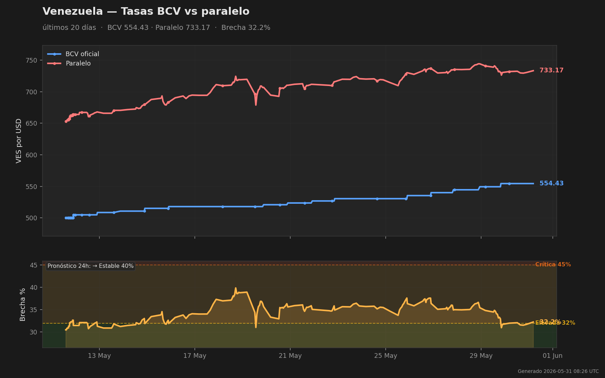

# Venezuela FX Monitor · Monitor Cambiario Venezuela

**English:** This bot doesn't just track the Venezuelan parallel exchange rate — it predicts it. Every morning it forecasts whether the spread between the BCV official rate and the parallel market will widen, hold, or narrow over the next 24 hours. Every forecast is automatically scored against what actually happened. The accuracy table below is a live track record, not a claim.

**Español:** Este bot no solo monitorea la tasa de cambio paralela venezolana — la predice. Cada mañana pronostica si la brecha entre la tasa oficial BCV y el mercado paralelo se ensanchará, se mantendrá o se estrechará en las próximas 24 horas. Cada pronóstico se puntúa automáticamente contra lo que realmente ocurrió. La tabla de precisión es un historial verificable en vivo, no una promesa.

---

## Today's Forecast · Pronóstico de Hoy

| Metric · Métrica | Value · Valor |
|---|---|
| BCV Oficial | **554.43** VES/USD |
| Paralelo | **733.17** VES/USD |
| Brecha · Spread | **32.2%** |
| Binance P2P USDT/VES | **733.96** VES/USDT (+0.1% vs paralelo) |
| **Pronóstico 24h · 24h Forecast** | **→ Estable · Stable (40%)** |
| Actualizado · Updated | 2026-05-31 04:26 UTC |

---

## Live Accuracy Track Record · Historial de Precisión en Vivo

Every day, several models with deliberately different assumptions compete — a base-rate baseline, kernel-analog models on oil/news/payday signals, a trend-follower, and a regime-transition model. A diversified **ensemble** then blends them. The blend is reliable for a precise reason: its error equals the average member's error *minus how much the members disagree*, so combining models that fail in different situations scores better than any one alone. Each prediction is scored against the actual outcome using **Brier score** — lower is better, a random guess scores 0.667, a perfect forecaster 0.000. Any model that fails to beat the naive baseline gets rejected.

Cada día compiten varios modelos con supuestos deliberadamente distintos — una línea base, modelos de analogía sobre señales de petróleo/noticias/quincena, un seguidor de tendencia y un modelo de transición de régimen. Un **ensemble** diversificado los combina. La combinación es fiable por una razón precisa: su error es igual al error promedio de los miembros *menos cuánto difieren entre sí*, así que combinar modelos que fallan en situaciones distintas puntúa mejor que cualquiera por separado. Cada predicción se puntúa con **Brier score** — menor es mejor, aleatorio 0.667, perfecto 0.000. Cualquier modelo que no supere la línea base se descarta.

| Model · Modelo | Brier ↓ | vs Baseline | Forecasts Scored · Evaluados |
|---|---|---|---|
| naive (baseline) | 0.7234 | — | 14 |
| stat | 0.6892 | −0.0342 ✓ | 14 |
| stat\_v2 (oil + news · petróleo + noticias) | 0.6876 | −0.0358 ✓ | 13 |
| stat\_v3 (+ payday · quincena) | 0.7018 | −0.0216 ✓ | 13 |
| momentum (trend · tendencia) | 0.7921 | +0.0687 ✗ | 11 |
| markov (regime · régimen) | 0.8060 | +0.0826 ✗ | 11 |
| **ensemble (blend · combinación)** | 0.7486 | +0.0252 ✗ | 11 |

*Accumulating live data since May 2026 · Acumulando datos en vivo desde mayo 2026*

→ Full forecast probabilities: [data/forecast.json](data/forecast.json)
→ Full accuracy history: [data/accuracy.json](data/accuracy.json)

---

## Signals Used · Señales Utilizadas

The models draw on four categories of signal:

| Signal | Source | Why it matters · Por qué importa |
|---|---|---|
| BCV & parallel rates | bcv.org.ve, ve.dolarapi.com | Core data — scraped every 30 min |
| Brent crude oil | FRED API (St. Louis Fed) | Oil shocks historically precede VES moves |
| FX news headlines | RSS: efectococuyo, elnacional, runrunes | BCV interventions & policy signals |
| Payday cycle | Computed from date | FX demand spikes predictably at quincena (15th & month-end) |

---

## Data Access · Acceso a Datos

All data is published automatically to this repository and free to use.

| File | Contents | Updated · Actualizado |
|---|---|---|
| [data/current.json](data/current.json) | Latest rate reading · Última lectura | Every scrape · Cada scrape |
| [data/forecast.json](data/forecast.json) | 24h forecasts, all models · Pronósticos 24h | Daily · Diario |
| [data/accuracy.json](data/accuracy.json) | Running Brier scores · Brier acumulado | Daily · Diario |
| [data/recent.csv](data/recent.csv) | Last 7 days of 30-min scrapes | Every scrape · Cada scrape |
| [data/daily.csv](data/daily.csv) | Daily avg / min / max spread | Every scrape · Cada scrape |
| [data/archive/](data/archive/) | Full history by month · Historial completo | Monthly · Mensual |

---

*Data is informational only and reflects scraped public sources. · Los datos son meramente informativos y reflejan fuentes públicas.*
